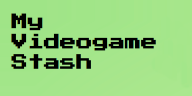
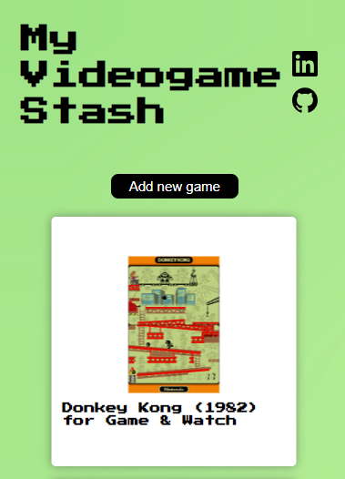
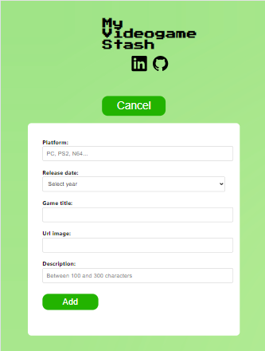
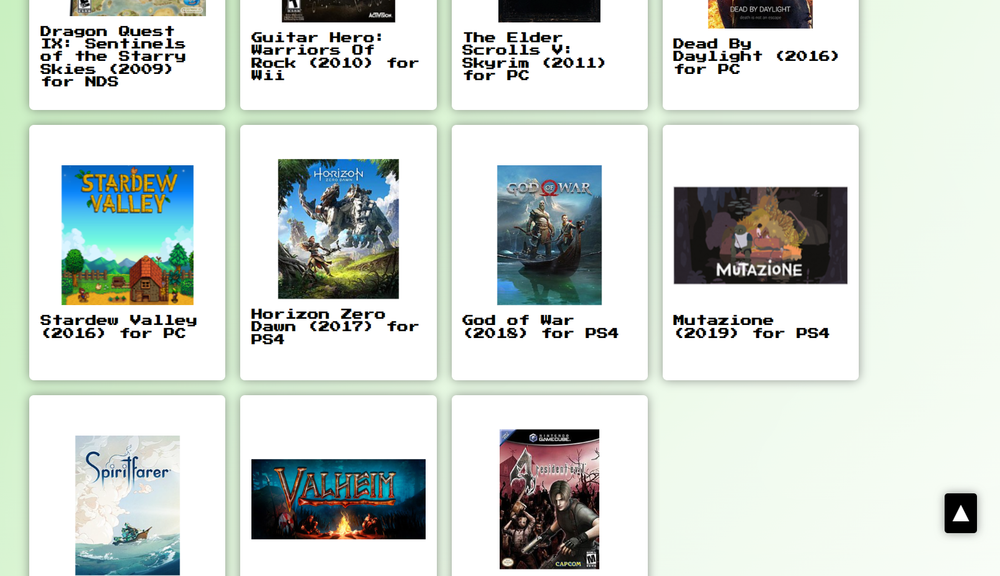

# 🕹 My Videogame Stash 

_Small compilation of my favorite games over the years developed with Create React App (CRA)._
<div align="center">
    
    
[](https://youtu.be/u7lEEm4qMUM?si=3zYoB26fY1Wi8ljq)
</div>

## ⚙ Inicialization
- Enter into the console:
```
npm install
```
 
```
npm start
```

- Open [http://localhost:3000](http://localhost:3000) to view it in your browser.





## 💻 Tech stack


